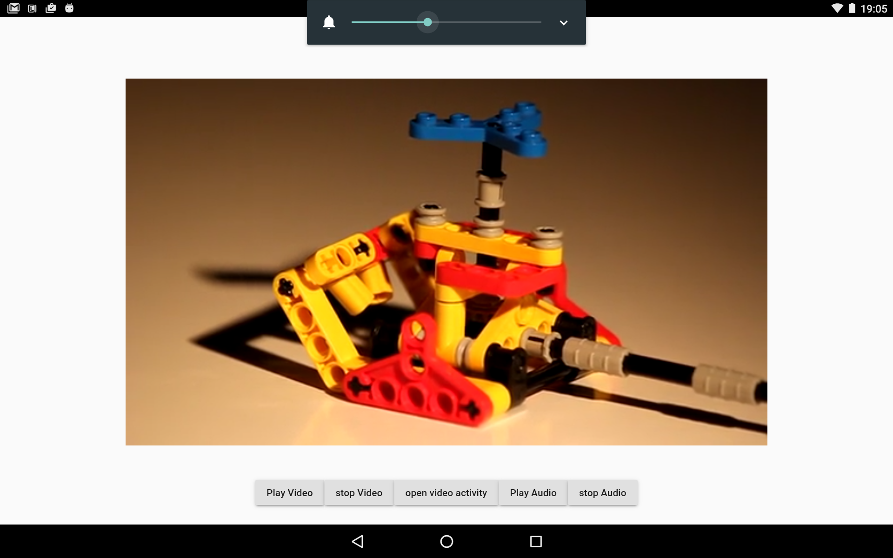
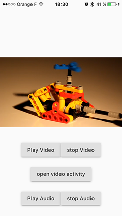
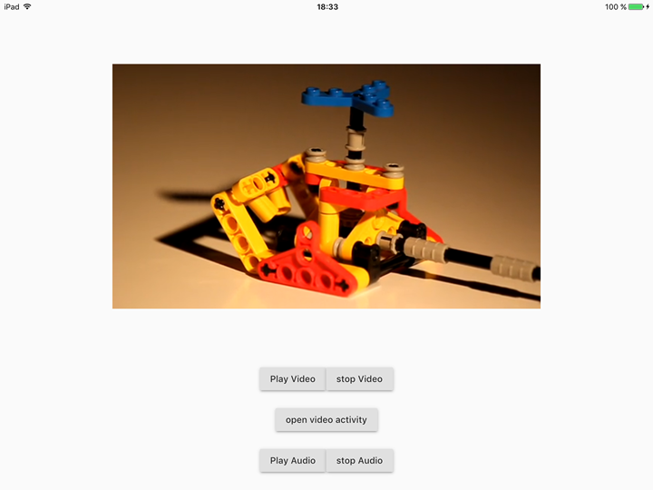

# Flutter mediaplayer plugin POC

Video & audio player for flutter

```bash
git clone
cd flutter-media-plugin
flutter packages get
flutter doctor
# after following all doctor's instructions
flutter run -d YOUR_DEVICE
```

## Dart

`PlatformMessages.sendString()`

```dart
Future<Null> _playAudio() async {
String reply = await PlatformMessages.sendString('playAudio', kAudioUrl);
print("playAudio => $reply");
}
```

## Android

=> cf. [MainActivity.java](https://github.com/rxlabz/flutter-mediaplayer-plugin/blob/master/android/app/src/main/java/com/example/flutter/MainActivity.java)

- Embedded player : VideoView added in mainActivity layout
- Video activity 



## iOS

=> cf. [AppDelegate.m](https://github.com/rxlabz/flutter-mediaplayer-plugin/blob/master/ios/Runner/AppDelegate.m)

- Embedded player : an UIView containing a AVPlayerLayer is added to FlutterController.view.layer
- Video activity : 
 



## PlatformMessages